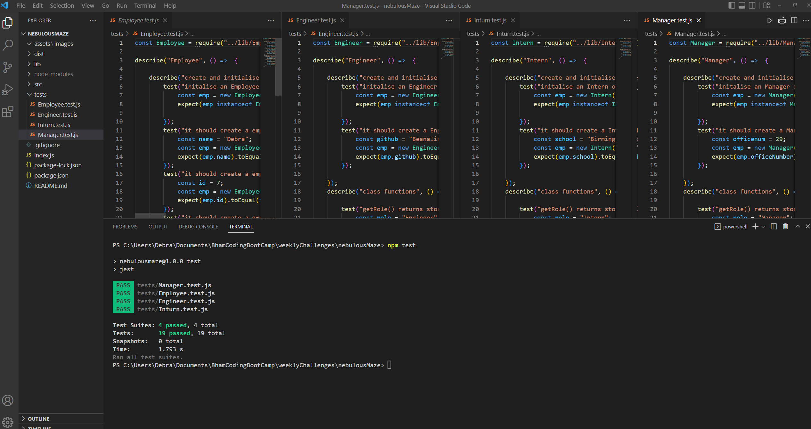

# Team Profile Generator [](https://opensource.org/licenses/MIT)  
  
  ## Table of Contents  
  * [Description](#description)
  * [Installation](#installation)
  * [Usage](#usage)
  * [Walk-through Video](walk-through-video)
  * [Tests](#tests)
  * [Technologies Used](#technologies-used)
  * [credits](#credits)
  * [Questions](#questions)
  * [How to Contribute](#How-to-Contribute)   
  * [License](#license)
  
  ## Description
  
  Having quick access to team members information details, such as email and Github profiles, is the motivation behind building a profile generator application. 

  The Team Profile Generator developed in this project is a command-line application that dynamically generates an HTML webpage which displays profile information for each team member, in response to a set of question prompts. This application uses Node JS and the npm inquirer version 8.2.4 package to provide the command-line user interface. Basic unit tests have been implemented using the npm Jest package along with validation testing of user input email address.  
  
  Future developments:
  - Further validation tests of user input data
 
  ### Functional Requirements

  The functional requirements that the README Generator has been designed to meet are defined by the user story and acceptance criteria listed below.  

#### User Story

  ```md
  AS A manager
  I WANT to generate a webpage that displays my team's basic info
  SO THAT I have quick access to their emails and GitHub profiles    
 ```

#### Acceptance Criteria

```md
    GIVEN a command-line application that accepts user input
WHEN I am prompted for my team members and their information
THEN an HTML file is generated that displays a nicely formatted team roster based on user input
WHEN I click on an email address in the HTML
THEN my default email program opens and populates the TO field of the email with the address
WHEN I click on the GitHub username
THEN that GitHub profile opens in a new tab
WHEN I start the application
THEN I am prompted to enter the team manager’s name, employee ID, email address, and office number
WHEN I enter the team manager’s name, employee ID, email address, and office number
THEN I am presented with a menu with the option to add an engineer or an intern or to finish building my team
WHEN I select the engineer option
THEN I am prompted to enter the engineer’s name, ID, email, and GitHub username, and I am taken back to the menu
WHEN I select the intern option
THEN I am prompted to enter the intern’s name, ID, email, and school, and I am taken back to the menu
WHEN I decide to finish building my team
THEN I exit the application, and the HTML is generated
 ```

  ## Installation
  
    To install dependencies run the terminal command, npm i 

  ## Usage
  
  - To run the Team Profile Generator App:
  
  - Enter ```node index.js``` at the terminal command-line prompt.
  - You will then be presented with the main menu which gives you the option to add a manager, engineer, intern or finish building the team. Navigate the options using the arrow keys and press enter to submit your selection.
    - If you select Manager, you will be asked to enter name, employee ID, email address and office number.
    - If you select Engineer, you will be asked to enter name, employee ID, email address and GitHub user name.
    - If you select Intern, you will be asked to enter name, employee ID, email address and school.
  - After you enter the team members information you will be taken back to the main menu where you can choose to add another team member.
  - When you have finshed adding team members, select the 'Team complete' option from the main menu.

    - your team profile webpage will be written 
      to a html file with the name  ```teamProfile.html```  in directory ```dist```.
  - If you to need to make changes to you team, or create further team profiles, follow the same steps. 
      -  the generated file is always written to the same file name (teamProfile.html), so will overwrite a file with the same name if it already exits:  either rename the existing file, or copy it to another directory.


  

  ## Walk-through Video

  A  walk-through video demonstrating the functionality of the Team Profile Generator can be viewed at the following link:

- [Team Profile Generator walk-through video]()

  ### Screen Shots 
  
  The following screen shot shows the prompts displayed to the user along with user answers

  


  The screen shot below displays the  HTML webpage generated from the user responses to the question prompts.

  ## Tests

  
  Test have been implemented using Jest Testing Framework to test the Employee, Mamanger, Engineer and Intern classes.  

      To run the Jest tests run the terminal command, ```npm test```

  The test result for all four classes are shown in the screen shot below: 

    

  ## Technologies Used
  - HTML
  - CSS
  - JavaScript
  - NodeJs
  - npm Inquirer Package
  - npm Jest Package
  

  ## Credits
  No other collaborators or resources were used in the development of this project.
  ## Questions
  If you have any questions regarding this project or contents of this repository, please contact me via:
  
  - email: dat826@gmail.com
  - GitHub: [Beanalini](https://github.com/Beanalini)  


  
  ## Contributing
  If you would like to contribute to this project you can contact me by email at dat826@gmail.com or through  GitHub account   @[Beanalini](https://github.com/Beanalini).
  

  ## License
  This project is covered under the MIT License  
  
  [](https://opensource.org/licenses/MIT) 
  